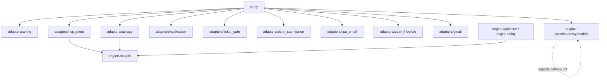
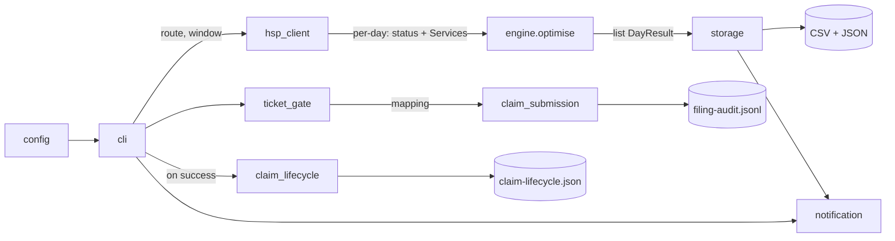
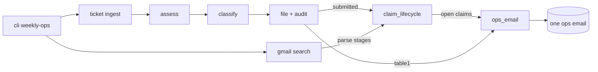
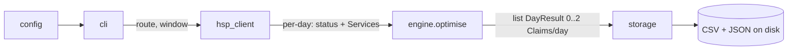

# Architecture Spine — Late Train Query Engine

## Design Paradigm

**Hexagonal (ports & adapters) with a pure-function domain core.** A greenfield
Python package replaces the existing monolithic `TrainLine/TestFileGenerator.py`.

| Layer | Namespace | Holds |
| --- | --- | --- |
| Domain core (pure) | `trainline/engine/` | `models`, `delay`, `optimiser` — the claimable-delay model; imports nothing I/O |
| Adapters (I/O) | `trainline/adapters/` | `hsp_client`, `storage`, `config`, `notification`, `ticket_gate`, `claim_submission` (+ pure `swr_mapping` helpers) |
| Composition root | `trainline/cli.py` | wires config → hsp_client → engine → storage; a future Lambda handler is a second root |

## Invariants & Rules

### AD-1 — Pure-function domain core `[ADOPTED]`
- **Binds:** `engine/*`, all I/O; FR11
- **Prevents:** disk/network/email/browser/cloud concerns leaking into the domain, which would make the core untestable and non-portable to Lambda
- **Rule:** `engine.optimise(days, config) -> list[DayResult]` (and everything under `engine/`) imports no I/O module and performs no I/O; `days` carries, per date, its fetch outcome and its `Service`s (AD-5). All side effects live in adapters, invoked only by a composition root. A bare `list[Claim]` is not a legal return — it cannot express a no-claim or failed day.

### AD-2 — Inward-only dependency direction
- **Binds:** all modules
- **Prevents:** dependency cycles and core-to-adapter coupling that would let two modules build against incompatible layering
- **Rule:** `engine` imports nothing in the package; `adapters/*` may import `engine.models` only; `cli` may import everything; **no adapter imports another adapter.** Dependencies point inward toward `engine`.

### AD-3 — `engine.models` is the single source of the data shape
- **Binds:** `engine.models`, `adapters/hsp_client`, `adapters/storage`; FR2, FR13
- **Prevents:** HSP JSON field names (`gbtt_pta`, `actual_ta`, `rids`, `late_canc_reason`…) bleeding into the core, and two divergent representations of a train/claim
- **Rule:** `Service`, `Claim`, and `DayResult` are defined once in `engine.models`. Raw HSP JSON → `Service` mapping happens **only inside `hsp_client`**; `Claim` → CSV/JSON serialisation happens **only inside `storage`**. The engine never sees a raw HSP dict. Actual-time fields are typed `int | None` (minutes, AD-4) where `None` means *no actual recorded* (unarrived/cancelled); the engine must skip any service where `cancelled` is true **or** the destination actual is `None`, rather than treating a missing time as delay 0.

### AD-4 — Times are integer minutes on a shared origin-day base
- **Binds:** `adapters/hsp_client`, `engine.delay`; FR6, FR8
- **Prevents:** ad-hoc `HHMM` parsing scattered through the core, and the cross-midnight bug where a 23:50→00:15 leg yields `delay = -1435` (silent miss) or a false `+1445`
- **Rule:** `hsp_client` parses HSP `HHMM` to `int` minutes **relative to the service's origin day** — a time past midnight carries `+1440`, so scheduled and actual for one leg always share a base and `actual - scheduled` is the true signed delay. `engine.delay.calculate_delay` is the **sole** owner of delay arithmetic; no other module subtracts times.

### AD-5 — Fetch failure is distinct from no-claim
- **Binds:** `adapters/hsp_client`, `engine.models`, `cli`; FR5, NFR1 (SM2/CM1)
- **Prevents:** a failed HSP fetch silently reading as "nothing to claim", which would miss claimable money invisibly
- **Rule:** `hsp_client` records per-service fetch outcomes and rolls them up per day. A day's `DayResult.status` is `OK` (claim/no-claim trustworthy) **only if every required leg — both directions' metrics and all their service details — fetched successfully**; if any required fetch failed the day is `FETCH_FAILED` and is reported as "not analysed", never as a clean no-claim. The engine passes `status` through unchanged (it does not own its meaning). A single failure logs and is skipped; it does not abort the run.

### AD-6 — Cancellation fallback is a gated pure code path
- **Binds:** `engine.optimiser`, `adapters/hsp_client`; FR12, OQ1
- **Prevents:** unverified cancellation logic shipping in the MVP, and the adapter owning domain fallback rules
- **Rule:** the cancellation fallback (next-catchable-service delay) lives inside `engine`, behind a flag that stays **off until OQ1 is resolved** (a real cancelled-train fixture exists). When on, an actual late train **always takes precedence** over a cancellation-derived claim for the same leg. `hsp_client` only surfaces the raw signal — sets `Service.cancelled` from empty actual times + `late_canc_reason`; it computes no fallback delay.

### AD-7 — Greenfield rewrite; behaviours re-implemented, not code
- **Binds:** the whole package; FR20, NFR3, NFR4
- **Prevents:** carrying the inverted old model (>1-min / both-legs / worst-per-day) and its tests forward, and losing the two behaviours that make the tool run and stay cheap
- **Rule:** the new package is written fresh; old logic and the tests pinning it are not preserved (FR20). But `hsp_client` **must** re-implement NFR3 (the AVG-TLS `REQUESTS_CA_BUNDLE` handling) and NFR4 (idempotent, skip-if-cached per-day/service fetching).

### AD-8 — Composition-root orchestration
- **Binds:** `cli`, `engine`; FR11, roadmap (Lambda)
- **Prevents:** multiple divergent orchestration paths and the engine coupling to the CLI
- **Rule:** `cli.py` is the only MVP orchestrator (fetch → optimise → write). Any future entry point (Lambda handler) is an **additional** composition root that calls the same `engine.optimise`; orchestration logic never moves into `engine`.

### AD-9 — Dependency direction (diagram)
- **Binds:** all modules
- **Prevents:** any import that violates AD-2
- **Rule:** the only legal import arrows are those below.



### AD-10 — Deterministic, total optimiser
- **Binds:** `engine.optimiser`; FR8, FR9, FR10, NFR1
- **Prevents:** non-idempotent output (same input, different claims) and two builders splitting ownership of the feasibility/tie-break rules
- **Rule:** `engine.optimiser` is the **sole** owner of feasibility (`inbound actual departure > outbound actual arrival`, strict, no interchange buffer) and of the tie-break, which is fully specified and total: on equal total payout order by (1) fewer claim rows, (2) earliest outbound, (3) earliest inbound. Identical input yields identical output. The objective is a single function whose signature accepts an **optional per-day cap** (default none) so OQ2's stacking resolution is a localised change, not a structural one.

### AD-11 — Band & payout contract
- **Binds:** `engine.delay`, `engine.models`, `adapters/storage`; FR7, FR13, OQ2
- **Prevents:** a `payout(None)` crash on a sub-threshold service, and unit/arity clashes between callers
- **Rule:** `band(delay_min) -> Band` returns an enum that includes an explicit `Band.NONE` for sub-15-min; `payout(band) -> float` returns the numeric percentage with `payout(Band.NONE) == 0`. MVP surfaces the band/percentage, not a £/pence figure (PRD FR14). Any OQ2 extension adds parameters (ticket fare, cap) to `payout`; it does not change the return unit silently.
  - _Amended 2026-07-14 (Simon): return type `-> int` → `-> float`; the open-day-return track pays 12.5% at the 15–29 band, which is not an integer._

### AD-12 — Test-first (TDD) per story
- **Binds:** every story/epic; FR19, FR20, FR21, NFR1
- **Prevents:** stories built without tests, or tests retrofitted to rubber-stamp whatever the code happened to do (which is exactly how the old model's wrong behaviour got locked in — FR20)
- **Rule:** each story is built **test-first**. Its acceptance criteria are encoded as **executable acceptance tests written before the implementation** — expressed as pytest-bdd Gherkin scenarios (`@offline` by default) that map one-to-one to the criteria — and each must be seen to **fail first, then pass**. Engine logic (`delay`, `optimiser`) is driven by TDD unit tests underneath. A story is not done until its acceptance tests are green and no criterion is without a test. Every story carries its acceptance tests inline.

### AD-13 — Notification adapter seam (Release 2) `[ADOPTED 2026-07-16]`
- **Binds:** `adapters/notification`, `cli`; FR22, NFR7, NFR9
- **Prevents:** SMTP/email concerns leaking into engine or submission adapter
- **Rule:** `notification.send_digest(subject, html, text)` is the sole email entry point. SMTP transport is injectable for offline tests. Credentials from env/config only.

### AD-14 — Ticket gate adapter (Release 2) `[ADOPTED 2026-07-16]`
- **Binds:** `adapters/ticket_gate`, `cli`; FR23, FR24, FR25, NFR7
- **Prevents:** ticket filesystem logic coupling to browser automation
- **Rule:** `ticket_gate` owns scan, parse, and claim-to-file matching. Returns `MatchResult(ok, missing_dates, mapping)`. No Playwright imports. Naming contract: `<MM-DD-TICKET_NUMBER>.{jpg|jpeg|png|pdf}`.

### AD-15 — Claim submission adapter (Release 2) `[ADOPTED 2026-07-16]`
- **Binds:** `adapters/claim_submission`, `adapters/swr_mapping` (pure); FR26, FR27, FR28, NFR7, NFR8, NFR9
- **Prevents:** browser automation leaking into engine or ticket gate
- **Rule:** **Playwright** is the binding browser stack (not Selenium). `submit_claim(claim, ticket_path, mapped_fields)` and `submit_all(claims, mapping)` accept injectable `Page`/`BrowserContext` for offline tests. SWR field mapping lives in pure `swr_mapping` helpers importable without Playwright. Live tests `@live` gated.

### AD-16 — Filing audit log (Release 2) `[ADOPTED 2026-07-16]`
- **Binds:** `adapters/claim_submission` or `filing_audit` helper; FR29, NFR10
- **Prevents:** silent or non-replayable filing history
- **Rule:** append-only JSONL at configurable path (default `results/filing-audit.jsonl`). One line per attempt. Partial batch failure appends error lines; never truncates prior entries.

### AD-17 — Release 2 CLI pipeline `[ADOPTED 2026-07-16]`
- **Binds:** `cli`; FR30, FR31, AD-8
- **Prevents:** multiple divergent filing orchestration paths
- **Rule:** `--file` runs: assess → storage → ticket_gate → claim_submission (batch) → audit → notification (digest). Ticket gate failure: output written, submit skipped, non-zero exit. Default run (no `--file`) is Release 1 assess-only. `cli` is still the sole orchestrator; adapters never call each other.

### AD-18 — Claim lifecycle store `[ADOPTED 2026-07-27]`
- **Binds:** `adapters/claim_lifecycle`, `cli`; FR37, FR38, FR39
- **Prevents:** mutable status living in `filing-audit.jsonl`, or `ops_email` inventing claim state
- **Rule:** New adapter `claim_lifecycle` owns **current** claim status keyed by SWR claim id (`SWR-####-###-###`). Default path `Results/claim-lifecycle.json` (single JSON object map). **Persisted statuses only:** `submitted` | `received` | `approved` | `paid` | `failed`. Record fields: `claim_id`, `status`, `date`, `direction`, optional `amount_gbp`, `updated_at`, and `reported_paid_at` (ISO timestamp or null). **Filing audit (AD-16) stays append-only history** and is never rewritten as status. `[ASSUMPTION]` JSON file (not SQLite) until concurrency appears. Table 2 display may label `submitted` as `in_flight` — that label is presentation only, not a store value.

### AD-19 — Lifecycle mutation ownership `[ADOPTED 2026-07-27]`
- **Binds:** `cli`, `claim_lifecycle`, `gmail.claim_mail` (pure parse), Gmail client; FR37, FR38, AD-2, AD-8
- **Prevents:** two writers of status, or adapters importing each other
- **Rule:** Only `cli` mutates lifecycle. (1) On **successful** live file: `record_submitted(claim_id, date, direction, …)` from the submit result. (2) Before ops email: Gmail search → `parse_swr_claim_mail` / `parse_gmail_message` → `apply_stage(claim_id, stage)`. **Monotonic rank:** `submitted` < `received` < `approved` < `paid`; `failed` is terminal and does not advance further; never regress. `claim_lifecycle` does **not** import Gmail; `claim_mail` stays pure string→DTO. Optional one-shot backfill from audit success lines is a **cli** helper that uses the audit's `swr_reference` field only (no alternate claim-id extractors).

### AD-20 — Ops email Table 1 + Table 2 `[ADOPTED 2026-07-27]`
- **Binds:** `adapters/ops_email`, `cli`; FR36, FR37, FR39
- **Prevents:** a second email path or the renderer owning Gmail/lifecycle I/O
- **Rule:** One weekly ops email. `ops_email.render_ops_email(table1, table2, …)` remains a **pure** renderer. `cli` builds Table 2 from `claim_lifecycle.open_for_table2()`: include rows where `reported_paid_at` is null (still open **or** paid but not yet shown in a sent digest). After a successful ops email send, `cli` calls `mark_reported_paid()` for every Table 2 row that was sent with status `paid`. Display may map `submitted` → `in_flight` in the email only.

### AD-21 — Weekly ops chain includes lifecycle refresh `[ADOPTED 2026-07-27]`
- **Binds:** `cli` `--weekly-ops`; FR34, FR37, FR39, AD-8, AD-17
- **Prevents:** emailing Table 2 before inbox refresh, or marking the week complete without attempting lifecycle+email
- **Rule:** `--weekly-ops` order: ticket ingest → assess → classify → file → **lifecycle refresh** → ops email (Table 1 + Table 2) → `mark_reported_paid` for paid rows included → completion marker. Lifecycle refresh is **best-effort**: Gmail/parse failures log a warning and Table 2 uses store state as-is; they do not skip Table 1 email. Marker only after the email step succeeds. `--file` alone may `record_submitted` but does not require Gmail refresh.

## Consistency Conventions

| Concern | Convention |
| --- | --- |
| Naming | `snake_case` modules/functions; `PascalCase` dataclasses (`Service`, `Claim`, `DayResult`); adapters named by role (`hsp_client`, `storage`, `config`); CRS station codes uppercase (`GOD`, `WAT`). |
| Data & formats | dates ISO `YYYY-MM-DD`; times `int` origin-day-relative minutes inside the core (AD-4); band as a `Band` enum with numeric `payout` (AD-11); output written as **both** CSV and JSON (FR14), sorted by date then direction so a week reads at a glance (FR15) — owned by `storage`. |
| State & cross-cutting | no global mutable state — `config` passed explicitly (FR16); credentials only from `HSP_CREDENTIALS_FILE`, never in the repo (FR17); errors surfaced via `DayResult.status`, never swallowed (AD-5); response cache is a private detail of `hsp_client`. |
| Testing | **test-first** — acceptance criteria become pytest-bdd Gherkin scenarios written before code (AD-12). The HTTP call in `hsp_client` is an **injectable seam** (session/transport passed in), so default tests run offline against fixtures with no network or credentials; live tests are opt-in and skip cleanly without `HSP_CREDENTIALS_FILE` (NFR2, FR21). |

## Stack

| Name | Version |
| --- | --- |
| Python | 3.10+ (dev on 3.12) |
| requests | >=2.25 (pinned in `requirements-dev.txt`) |
| pytest | >=7.0 |
| pytest-bdd | >=7.0 |
| playwright | >=1.40 |
| Pillow | >=10.0 |
| pdfplumber | >=0.11 (booking confirmation PDF text) |
| google-api-python-client / google-auth* | Gmail adapter (see `requirements-dev.txt`) |

## Structural Seed

```text
trainline/
  engine/                # pure domain core — imports nothing I/O (AD-1)
    models.py            #   Service, Claim, DayResult (AD-3)
    delay.py             #   calculate_delay, band(delay), payout(band)
    optimiser.py         #   per-day max-payout optimise + cancellation path (AD-6)
  adapters/
    hsp_client.py        #   HSP HTTP + auth + TLS/CA-bundle + response cache
    storage.py           #   Claim -> CSV + JSON (FR14)
    config.py            #   route / time window / credentials (FR16,17)
    notification.py      #   SMTP digest (AD-13, FR22)
    ticket_gate.py       #   ticket scan + claim match (AD-14, FR23-25)
    swr_mapping.py       #   pure CRS/reason mapping (AD-15, FR27)
    claim_submission.py  #   Playwright SWR submit + audit (AD-15,16, FR26-29)
    ops_email.py         #   pure Table1/Table2 renderer (AD-20)
    claim_lifecycle.py   #   mutable claim status store (AD-18,19)
    gmail/               #   OAuth client + claim_mail parse + ticket_mail
  cli.py                 # composition root — assess, --file, --weekly-ops (AD-8,17,21)
tests/
  ...                    # offline + @live/@gmail gated; import-boundary test extended (NFR7)
```

Data flow (Release 2 `--file` run):



Data flow (`--weekly-ops` with Table 2):



Data flow (Release 1 default — unchanged):



## Capability → Architecture Map

| Capability / Area | Lives in | Governed by |
| --- | --- | --- |
| FR1–FR5 HSP acquisition, cache, all-RID extraction, failure tracking | `adapters/hsp_client` | AD-3, AD-4, AD-5, AD-7 |
| FR6–FR8 delay, banding, feasibility | `engine/delay`, `engine/optimiser` | AD-4, AD-11, AD-10 |
| FR9–FR10 max-payout optimisation, tie-break | `engine/optimiser` | AD-10 |
| FR11 pure core | `engine/*` | AD-1, AD-8 |
| FR12 cancellation fallback | `engine/optimiser` (gated) | AD-6 |
| FR13–FR15 claim output (SWR fields, CSV+JSON, sorted) | `adapters/storage` | AD-3, AD-11 |
| FR16–FR18 config-driven route/window/creds, season-ticket-ready | `adapters/config`, `engine.models` | AD-3 |
| FR19–FR21, NFR2 new-model test suite, offline-first, test-first | `tests/`, `adapters/hsp_client` seam | AD-7, AD-12, testing convention |
| FR22 email digest | `adapters/notification` | AD-13, AD-2 |
| FR23–FR25 ticket gate | `adapters/ticket_gate` | AD-14, AD-2 |
| FR26–FR28 SWR auto-file + mapping | `adapters/claim_submission`, `adapters/swr_mapping` | AD-15, AD-2 |
| FR29 filing audit | `adapters/claim_submission` | AD-16 |
| FR30–FR31 `--file` pipeline | `cli` | AD-17, AD-8 |
| FR32–FR34, FR40 weekly ops + Gmail | `cli`, `adapters/gmail`, `weekly_marker` | AD-8, AD-21 |
| FR36 Table 1 ops email | `adapters/ops_email`, `cli` | AD-20 |
| FR37–FR39 Table 2 + lifecycle | `adapters/claim_lifecycle`, `gmail.claim_mail`, `cli` | AD-18, AD-19, AD-20, AD-21 |
| FR41–FR45 phone / booking ingest | `gmail.ticket_mail`, `booking_pdf`, `ticket_drop` | AD-2, AD-8 |

## Deferred

- **Infra / deployment / AWS / Terraform** — cancelled for product; local Windows + Task Scheduler only.
- **Paper-ticket image preprocessor** — after Table 2; deskew/crop fare strip for APTIS OCR when no booking PDF.
- **Season-ticket band track** — FR18 data model ready; logic deferred.
- **SQLite / multi-writer lifecycle** — revisit if JSON store contention appears.
- **Explicit SWR failure-mail → `failed` status** — characterise when a real failure sample exists; until then missing inbox stages remain `submitted` (shown as `in_flight` in Table 2).
- **Lambda handler** — second composition root; not planned.
- ~~OQ1 cancellation~~ — resolved; AD-6 on by default.
- ~~OQ2 payout base / stacking~~ — resolved 2026-07-17 (12.5% of return; two claims/day).
- ~~OQ4 captcha~~ — resolved; headed fill-to-Review + human Submit.
- ~~Photo OCR / ticket ingest / booking PDF~~ — shipped Releases 4–5.
