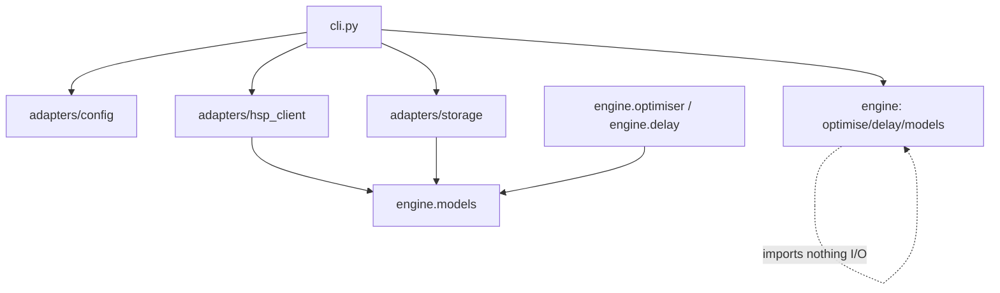
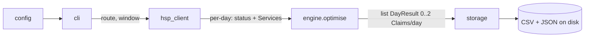

# Architecture Spine — Late Train Query Engine

## Design Paradigm

**Hexagonal (ports & adapters) with a pure-function domain core.** A greenfield
Python package replaces the existing monolithic `TrainLine/TestFileGenerator.py`.

| Layer | Namespace | Holds |
| --- | --- | --- |
| Domain core (pure) | `trainline/engine/` | `models`, `delay`, `optimiser` — the claimable-delay model; imports nothing I/O |
| Adapters (I/O) | `trainline/adapters/` | `hsp_client`, `storage`, `config` — the outside world, mapped to/from domain types |
| Composition root | `trainline/cli.py` | wires config → hsp_client → engine → storage; a future Lambda handler is a second root |

## Invariants & Rules

### AD-1 — Pure-function domain core `[ADOPTED]`
- **Binds:** `engine/*`, all I/O; FR11
- **Prevents:** disk/network/email/browser/cloud concerns leaking into the domain, which would make the core untestable and non-portable to Lambda
- **Rule:** `engine.optimise(days, config) -> list[DayResult]` (and everything under `engine/`) imports no I/O module and performs no I/O; `days` carries, per date, its fetch outcome and its `Service`s (AD-5). All side effects live in adapters, invoked only by a composition root. A bare `list[Claim]` is not a legal return — it cannot express a no-claim or failed day.

### AD-2 — Inward-only dependency direction
- **Binds:** all modules
- **Prevents:** dependency cycles and core-to-adapter coupling that would let two modules build against incompatible layering
- **Rule:** `engine` imports nothing in the package; `adapters/*` may import `engine.models` only; `cli` may import everything; **no adapter imports another adapter.** Dependencies point inward toward `engine`.

### AD-3 — `engine.models` is the single source of the data shape
- **Binds:** `engine.models`, `adapters/hsp_client`, `adapters/storage`; FR2, FR13
- **Prevents:** HSP JSON field names (`gbtt_pta`, `actual_ta`, `rids`, `late_canc_reason`…) bleeding into the core, and two divergent representations of a train/claim
- **Rule:** `Service`, `Claim`, and `DayResult` are defined once in `engine.models`. Raw HSP JSON → `Service` mapping happens **only inside `hsp_client`**; `Claim` → CSV/JSON serialisation happens **only inside `storage`**. The engine never sees a raw HSP dict. Actual-time fields are typed `int | None` (minutes, AD-4) where `None` means *no actual recorded* (unarrived/cancelled); the engine must skip any service where `cancelled` is true **or** the destination actual is `None`, rather than treating a missing time as delay 0.

### AD-4 — Times are integer minutes on a shared origin-day base
- **Binds:** `adapters/hsp_client`, `engine.delay`; FR6, FR8
- **Prevents:** ad-hoc `HHMM` parsing scattered through the core, and the cross-midnight bug where a 23:50→00:15 leg yields `delay = -1435` (silent miss) or a false `+1445`
- **Rule:** `hsp_client` parses HSP `HHMM` to `int` minutes **relative to the service's origin day** — a time past midnight carries `+1440`, so scheduled and actual for one leg always share a base and `actual - scheduled` is the true signed delay. `engine.delay.calculate_delay` is the **sole** owner of delay arithmetic; no other module subtracts times.

### AD-5 — Fetch failure is distinct from no-claim
- **Binds:** `adapters/hsp_client`, `engine.models`, `cli`; FR5, NFR1 (SM2/CM1)
- **Prevents:** a failed HSP fetch silently reading as "nothing to claim", which would miss claimable money invisibly
- **Rule:** `hsp_client` records per-service fetch outcomes and rolls them up per day. A day's `DayResult.status` is `OK` (claim/no-claim trustworthy) **only if every required leg — both directions' metrics and all their service details — fetched successfully**; if any required fetch failed the day is `FETCH_FAILED` and is reported as "not analysed", never as a clean no-claim. The engine passes `status` through unchanged (it does not own its meaning). A single failure logs and is skipped; it does not abort the run.

### AD-6 — Cancellation fallback is a gated pure code path
- **Binds:** `engine.optimiser`, `adapters/hsp_client`; FR12, OQ1
- **Prevents:** unverified cancellation logic shipping in the MVP, and the adapter owning domain fallback rules
- **Rule:** the cancellation fallback (next-catchable-service delay) lives inside `engine`, behind a flag that stays **off until OQ1 is resolved** (a real cancelled-train fixture exists). When on, an actual late train **always takes precedence** over a cancellation-derived claim for the same leg. `hsp_client` only surfaces the raw signal — sets `Service.cancelled` from empty actual times + `late_canc_reason`; it computes no fallback delay.

### AD-7 — Greenfield rewrite; behaviours re-implemented, not code
- **Binds:** the whole package; FR20, NFR3, NFR4
- **Prevents:** carrying the inverted old model (>1-min / both-legs / worst-per-day) and its tests forward, and losing the two behaviours that make the tool run and stay cheap
- **Rule:** the new package is written fresh; old logic and the tests pinning it are not preserved (FR20). But `hsp_client` **must** re-implement NFR3 (the AVG-TLS `REQUESTS_CA_BUNDLE` handling) and NFR4 (idempotent, skip-if-cached per-day/service fetching).

### AD-8 — Composition-root orchestration
- **Binds:** `cli`, `engine`; FR11, roadmap (Lambda)
- **Prevents:** multiple divergent orchestration paths and the engine coupling to the CLI
- **Rule:** `cli.py` is the only MVP orchestrator (fetch → optimise → write). Any future entry point (Lambda handler) is an **additional** composition root that calls the same `engine.optimise`; orchestration logic never moves into `engine`.

### AD-9 — Dependency direction (diagram)
- **Binds:** all modules
- **Prevents:** any import that violates AD-2
- **Rule:** the only legal import arrows are those below.



### AD-10 — Deterministic, total optimiser
- **Binds:** `engine.optimiser`; FR8, FR9, FR10, NFR1
- **Prevents:** non-idempotent output (same input, different claims) and two builders splitting ownership of the feasibility/tie-break rules
- **Rule:** `engine.optimiser` is the **sole** owner of feasibility (`inbound actual departure > outbound actual arrival`, strict, no interchange buffer) and of the tie-break, which is fully specified and total: on equal total payout order by (1) fewer claim rows, (2) earliest outbound, (3) earliest inbound. Identical input yields identical output. The objective is a single function whose signature accepts an **optional per-day cap** (default none) so OQ2's stacking resolution is a localised change, not a structural one.

### AD-11 — Band & payout contract
- **Binds:** `engine.delay`, `engine.models`, `adapters/storage`; FR7, FR13, OQ2
- **Prevents:** a `payout(None)` crash on a sub-threshold service, and unit/arity clashes between callers
- **Rule:** `band(delay_min) -> Band` returns an enum that includes an explicit `Band.NONE` for sub-15-min; `payout(band) -> float` returns the numeric percentage with `payout(Band.NONE) == 0`. MVP surfaces the band/percentage, not a £/pence figure (PRD FR14). Any OQ2 extension adds parameters (ticket fare, cap) to `payout`; it does not change the return unit silently.
  - _Amended 2026-07-14 (Simon): return type `-> int` → `-> float`; the open-day-return track pays 12.5% at the 15–29 band, which is not an integer._

### AD-12 — Test-first (TDD) per story
- **Binds:** every story/epic; FR19, FR20, FR21, NFR1
- **Prevents:** stories built without tests, or tests retrofitted to rubber-stamp whatever the code happened to do (which is exactly how the old model's wrong behaviour got locked in — FR20)
- **Rule:** each story is built **test-first**. Its acceptance criteria are encoded as **executable acceptance tests written before the implementation** — expressed as pytest-bdd Gherkin scenarios (`@offline` by default) that map one-to-one to the criteria — and each must be seen to **fail first, then pass**. Engine logic (`delay`, `optimiser`) is driven by TDD unit tests underneath. A story is not done until its acceptance tests are green and no criterion is without a test. Every story carries its acceptance tests inline.

## Consistency Conventions

| Concern | Convention |
| --- | --- |
| Naming | `snake_case` modules/functions; `PascalCase` dataclasses (`Service`, `Claim`, `DayResult`); adapters named by role (`hsp_client`, `storage`, `config`); CRS station codes uppercase (`GOD`, `WAT`). |
| Data & formats | dates ISO `YYYY-MM-DD`; times `int` origin-day-relative minutes inside the core (AD-4); band as a `Band` enum with numeric `payout` (AD-11); output written as **both** CSV and JSON (FR14), sorted by date then direction so a week reads at a glance (FR15) — owned by `storage`. |
| State & cross-cutting | no global mutable state — `config` passed explicitly (FR16); credentials only from `HSP_CREDENTIALS_FILE`, never in the repo (FR17); errors surfaced via `DayResult.status`, never swallowed (AD-5); response cache is a private detail of `hsp_client`. |
| Testing | **test-first** — acceptance criteria become pytest-bdd Gherkin scenarios written before code (AD-12). The HTTP call in `hsp_client` is an **injectable seam** (session/transport passed in), so default tests run offline against fixtures with no network or credentials; live tests are opt-in and skip cleanly without `HSP_CREDENTIALS_FILE` (NFR2, FR21). |

## Stack

| Name | Version |
| --- | --- |
| Python | 3.10+ (dev on 3.12) |
| requests | >=2.31 |
| pytest | >=7.0 |
| pytest-bdd | >=7.0 |

## Structural Seed

```text
trainline/
  engine/                # pure domain core — imports nothing I/O (AD-1)
    models.py            #   Service, Claim, DayResult (AD-3)
    delay.py             #   calculate_delay, band(delay), payout(band)
    optimiser.py         #   per-day max-payout optimise + gated cancellation path (AD-6)
  adapters/
    hsp_client.py        #   HSP HTTP + auth + TLS/CA-bundle + response cache; JSON->Service (AD-3,4,5,7)
    storage.py           #   Claim -> CSV + JSON (FR14)
    config.py            #   route / time window / credentials (FR16,17)
  cli.py                 # composition root (AD-8)
tests/
  ...                    # new-model unit + BDD tests (FR19-21); old-behaviour tests removed (FR20)
```

Data flow (one run):



## Capability → Architecture Map

| Capability / Area | Lives in | Governed by |
| --- | --- | --- |
| FR1–FR5 HSP acquisition, cache, all-RID extraction, failure tracking | `adapters/hsp_client` | AD-3, AD-4, AD-5, AD-7 |
| FR6–FR8 delay, banding, feasibility | `engine/delay`, `engine/optimiser` | AD-4, AD-11, AD-10 |
| FR9–FR10 max-payout optimisation, tie-break | `engine/optimiser` | AD-10 |
| FR11 pure core | `engine/*` | AD-1, AD-8 |
| FR12 cancellation fallback | `engine/optimiser` (gated) | AD-6 |
| FR13–FR15 claim output (SWR fields, CSV+JSON, sorted) | `adapters/storage` | AD-3, AD-11 |
| FR16–FR18 config-driven route/window/creds, season-ticket-ready | `adapters/config`, `engine.models` | AD-3 |
| FR19–FR21, NFR2 new-model test suite, offline-first, test-first | `tests/`, `adapters/hsp_client` seam | AD-7, AD-12, testing convention |

## Deferred

- **Infra / deployment / AWS / Terraform** — out of scope by the roadmap; no provisioning until the automation that needs it exists.
- **Roadmap adapters** (email digest, SWR auto-filing, ticket ingest, Lambda handler) — added later as new adapters + composition roots behind the same boundaries (AD-1, AD-8); no port shapes fixed now beyond the pure-core contract.
- **OQ1 — cancellation JSON shape** — the AD-6 flag stays off until a real cancelled-train fixture pins the shape.
- **OQ2 — payout base & claim stacking** — pre-provisioned, not fully deferrable: `engine.delay.payout` takes ticket-type parameters and `engine.optimiser`'s objective accepts an optional per-day cap (AD-10, AD-11). So the *single-vs-return base* is a data change, but if SWR **caps** stacked claims the objective flips from `max Σ` to `max min(Σ, cap)` — that path exists in the signature now; resolving OQ2 sets the cap value rather than restructuring the optimiser.
